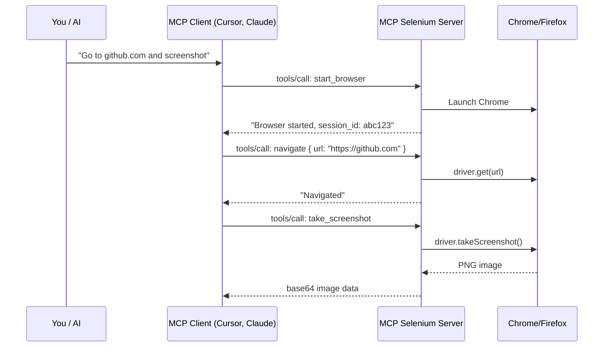
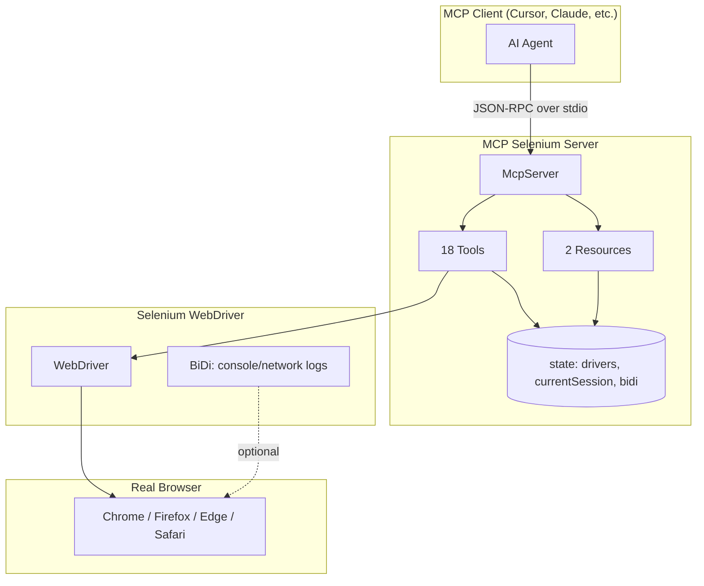
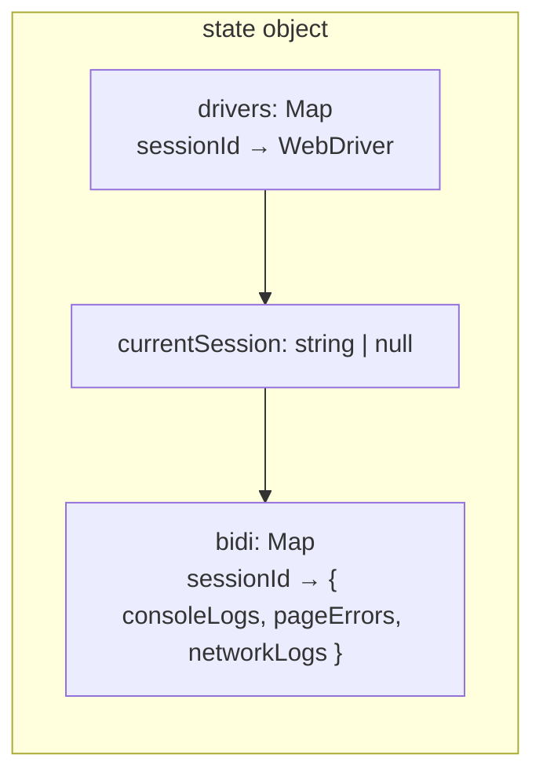

# MCP Selenium — Learn & Contribute Guide

A beginner-friendly walkthrough of this project. Perfect if you're new to MCP, Selenium, or browser automation.

---

## 1. What Problem Does This Solve?

Imagine you're chatting with an AI assistant (Claude, Cursor, etc.) and you say:

> *"Open Chrome, go to github.com, and take a screenshot."*

Without this project, the AI would have to write code, run it, and hope it works. **With MCP Selenium**, the AI can directly control a real browser through standardized tools — no manual scripting needed.

```
┌─────────────────┐         ┌──────────────────┐         ┌─────────────────┐
│   You / AI      │  "Go to │  MCP Selenium    │  drives │  Real Browser   │
│   (Cursor,      │ ──────► │  Server          │ ──────► │  (Chrome, etc.) │
│   Claude, etc.) │  tools  │  (this project)  │  Selenium│                 │
└─────────────────┘         └──────────────────┘         └─────────────────┘
```

---

## 2. Key Concepts (In Plain English)

| Term | What It Means |
|------|---------------|
| **MCP** | Model Context Protocol — a standard way for AI apps to talk to external tools (like a browser). Think of it as "USB for AI." |
| **Selenium WebDriver** | A library that lets code control real browsers (click, type, navigate, etc.). Industry standard for browser automation. |
| **Tools** | Actions the AI can call: `start_browser`, `navigate`, `click`, `take_screenshot`, etc. |
| **Resources** | Read-only data the AI can fetch: e.g. accessibility tree of the page, browser status. |
| **stdio** | Communication over standard input/output — the server and client talk via JSON messages on stdin/stdout. |

---

## 3. How It Works (High-Level Flow)



**In short:** The AI sends JSON-RPC requests → the server runs Selenium commands → the browser does the work → results go back.

---

## 4. Project Structure (Visual Map)

```
mcp-selenium/
│
├── 📂 src/lib/
│   ├── server.js              ← 🧠 THE BRAIN: all tools, state, logic
│   └── accessibility-snapshot.js  ← Injected into browser to build page tree
│
├── 📂 bin/
│   └── mcp-selenium.js        ← CLI: spawns server as child process
│
├── 📂 test/
│   ├── mcp-client.mjs         ← Reusable test client (talks JSON-RPC over stdio)
│   ├── *.test.mjs             ← Tests by feature (browser, navigation, etc.)
│   └── fixtures/              ← HTML pages used in tests
│       ├── interactions.html
│       ├── locators.html
│       └── ...
│
├── package.json
├── README.md
└── AGENTS.md                  ← Developer conventions (read this before contributing!)
```

---

## 5. Architecture Diagram



---

## 6. The 18 Tools (Quick Reference)

| Category | Tools |
|----------|-------|
| **Browser** | `start_browser`, `close_session` |
| **Navigation** | `navigate` |
| **Interaction** | `interact` (click, doubleclick, rightclick, hover), `send_keys`, `press_key`, `upload_file` |
| **Inspection** | `get_element_text`, `get_element_attribute` |
| **Screenshots** | `take_screenshot` |
| **Advanced** | `execute_script`, `window`, `frame`, `alert` |
| **Cookies** | `add_cookie`, `get_cookies`, `delete_cookie` |
| **Debugging** | `diagnostics` (console, errors, network) |

---

## 7. Locator Strategies (How the AI Finds Elements)

When the AI wants to click a button or type in a field, it needs to **locate** that element. Supported strategies:

| Strategy | Example | Use When |
|----------|---------|----------|
| `id` | `#submit-btn` | Element has a unique `id` |
| `css` | `button.primary` | Flexible CSS selectors |
| `xpath` | `//button[@type='submit']` | Complex DOM paths |
| `name` | `username` | Form inputs with `name` |
| `tag` | `button` | Find by tag name |
| `class` | `btn-primary` | Find by CSS class |

---

## 8. State Model (What the Server Remembers)



- **drivers**: One WebDriver instance per browser session
- **currentSession**: Which session is "active" for tool calls
- **bidi**: WebDriver BiDi data (console logs, JS errors, network) — auto-captured when supported

---

## 9. How to Run & Test

```bash
# Install dependencies
npm install

# Run all tests (requires Chrome + chromedriver on PATH)
npm test
```

Tests spawn the real MCP server, call tools, and verify outcomes (e.g. "clicked" text appears after clicking a button).

---

## 10. How to Contribute

### Before Adding a New Tool

1. **Can it be a parameter on an existing tool?** (e.g. `interact` already has `action: click | doubleclick | ...`)
2. **Would an LLM realistically call it?** If it's too niche, maybe not.
3. **Can `execute_script` already do it?** For one-off JS, that might be enough.

### Tool Registration Pattern

```javascript
server.registerTool(
  "tool_name",
  { description: "...", inputSchema: { param: z.string().describe("...") } },
  async ({ param }) => {
    try {
      const driver = getDriver();
      // ... Selenium work ...
      return { content: [{ type: 'text', text: 'result' }] };
    } catch (e) {
      return { content: [{ type: 'text', text: `Error: ${e.message}` }], isError: true };
    }
  }
);
```

### After Adding a Tool

1. Add tests in the appropriate `test/*.test.mjs` file
2. Run `npm test`
3. Update `README.md` with the new tool's docs

### Conventions (from AGENTS.md)

- **ES Modules only** — `import`/`export`, no `require`
- **Zod schemas** — for tool input validation
- **No `console.log()`** — stdio is the transport; use `console.error()` for debug
- **Verify outcomes in tests** — don't just check "no error"; check that the action actually happened

---

## 11. Test File Map

| Test File | What It Covers |
|-----------|----------------|
| `server.test.mjs` | Tool registration, schemas |
| `browser.test.mjs` | start_browser, close_session, take_screenshot, multi-session |
| `navigation.test.mjs` | navigate, locator strategies |
| `interactions.test.mjs` | interact, send_keys, get_element_text, press_key, upload_file |
| `tools.test.mjs` | get_element_attribute, execute_script, window, frame, alert |
| `cookies.test.mjs` | add_cookie, get_cookies, delete_cookie |
| `bidi.test.mjs` | diagnostics (console/errors/network) |
| `resources.test.mjs` | accessibility-snapshot resource |

---

## 12. Example: End-to-End Flow

**User says:** *"Open Chrome, go to example.com, and take a screenshot."*

**What happens:**

1. Client sends `tools/call` with `name: "start_browser"`, `arguments: { browser: "chrome" }`
2. Server creates a `Builder().forBrowser('chrome')`, builds driver, stores in `state.drivers`
3. Client sends `tools/call` with `name: "navigate"`, `arguments: { url: "https://example.com" }`
4. Server calls `driver.get(url)`
5. Client sends `tools/call` with `name: "take_screenshot"`
6. Server calls `driver.takeScreenshot()`, returns base64 PNG to client
7. AI shows the screenshot to the user

---

## 13. Resources for Learning More

- [MCP Specification](https://modelcontextprotocol.io/specification/2025-11-25) — the protocol this server implements
- [Selenium WebDriver Docs](https://www.selenium.dev/documentation/webdriver/) — browser automation API
- [Zod](https://zod.dev/) — schema validation used for tool inputs

---

## 14. Quick Start Checklist

- [ ] Clone the repo and run `npm install`
- [ ] Run `npm test` (ensure Chrome + chromedriver are available)
- [ ] Read `AGENTS.md` for conventions
- [ ] Pick a small task: fix a typo, add a test, improve a tool's error message
- [ ] Open a PR with tests and README updates

Happy learning and contributing! 🚀
